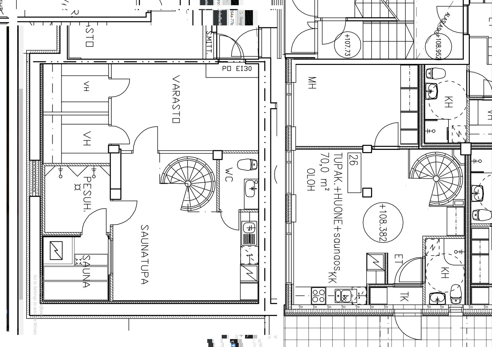
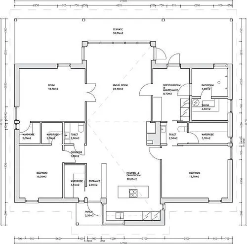
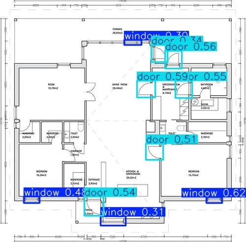

# YOLO Object Detection Project

This repository contains code and data for training and testing an object detection model using YOLO. The dataset consists of images and corresponding labels (bounding box annotations) divided into training and testing sets.

---

## Data Description

The dataset is organized into two zip files:

- **images.zip**  
  Contains two folders:  
  - `train/` — raw input images for training  
  - `test/` — raw input images for testing

- **labels.zip**  
  Contains two folders:  
  - `train/` — label files with bounding boxes for training images  
  - `test/` — label files with bounding boxes for test images

Each label file corresponds to an image and contains bounding box coordinates and class ids in YOLO format.

---

## Installation

1. **Clone the repository:**

```bash
git clone https://github.com/yourusername/your-repo-name.git
cd your-repo-name
```

2. **Install dependencies:**  
It is recommended to use a virtual environment.

```bash
pip install ultralytics
pip install -r requirements.txt  # if you have other dependencies
```

Alternatively, install the YOLO ultralytics package directly:

```bash
pip install ultralytics
```

---

## Prepare Data

1. Extract the `images.zip` and `labels.zip` files into your project directory so the folder structure looks like this:

```
/images
  /train
    img1.jpg
    img2.jpg
    ...
  /test
    imgA.jpg
    imgB.jpg
    ...
/labels
  /train
    img1.txt
    img2.txt
    ...
  /test
    imgA.txt
    imgB.txt
    ...
```

2. Prepare a `data.yaml` file with the dataset configuration, example:

```yaml
train: ./images/train
val: ./images/test

nc: 2  # number of classes
names: ['door', 'window']  # class names
```

---

## Training the Model

Use the YOLO command-line interface or Python API to start training.

**Using CLI:**

```bash
yolo task=detect mode=train model=yolov8s.pt data=data.yaml epochs=50 imgsz=640
```

- `task=detect`: object detection task  
- `mode=train`: train mode  
- `model=yolov8n.pt`: use pretrained YOLOv8 small weights  
- `data=data.yaml`: path to dataset config  
- `epochs=50`: number of epochs  
- `imgsz=640`: input image size

The trained weights will be saved in `runs/detect/train/weights/best.pt`.

---

## Running Prediction

To run prediction on test images after training:

```bash
yolo task=detect mode=predict model=runs/detect/train/weights/best.pt source=images/test conf=0.3 save=True
```

- `source=images/test`: folder with test images  
- `conf=0.3`: confidence threshold for detection  
- `save=True`: saves prediction images with bounding boxes to `runs/detect/predict`

---

## Sample Images

### Training Image Example  


### Test Image Example  


### Output After Training  


---

## Notes

- Make sure your labels are in YOLO format:  
  Each line in `.txt` file:  
  ```
  <class_id> <x_center> <y_center> <width> <height>
  ```
  where coordinates are normalized (0 to 1).

- The order of classes in `names` list must exactly match the class ids used in labels.


## Contact

For any queries, please contact: saviosunny48@gmail.com
